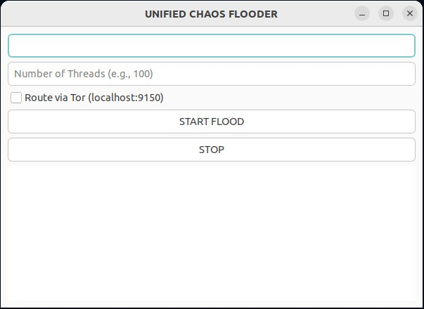

# 🌀 Chaos Flooder v3

**Chaos Flooder v3** is a GTK+ 3-based GUI HTTP flood tool I built to stress test the admin panels of my own home routers and wireless access points. A lot of consumer networking gear crumbles under basic request pressure, and I wanted an easy way to see where those limits are — without touching lower-layer traffic or writing custom curl scripts each time.

It’s a learning tool, a lab toy, and a fun way to explore how embedded web servers handle (or fail under) a little chaos.

> ⚠️ **IMPORTANT**  
> This tool is meant for **lab use only** — to test systems you personally own or are **explicitly authorized** to evaluate. Do **not** aim this at production systems, public servers, or third-party infrastructure. You are fully responsible for how you use this.

---

## ✨ Features

- 🖥️ **Graphical GTK+ 3 interface** – clean, lightweight, and scrollable  
- 🔁 **Multi-threaded engine** – powered by Python’s `ThreadPoolExecutor`  
- 🎯 **Custom target input** – enter any internal or test URL  
- 🧠 **10+ attack types** – all randomized per thread  
- 🧵 **Live request tracking** – logs success and error counts in real-time  
- 🕵️ **Tor support** – optional proxy via `localhost:9150` SOCKS5  
- 🎲 **Randomization** – rotates headers, IPs, user-agents, referrers  

---

## 🖼️ Screenshot



---

## 🔥 Attack Types

| Mode        | Description |
|-------------|-------------|
| `GET`        | Repeated GET requests to random paths |
| `POST`       | Sends randomized form data in POST requests |
| `RANGE`      | Adds `Range: bytes=0-999999999` headers to exhaust memory/disk |
| `CACHE`      | Appends unique `?cb=` params to bypass caching |
| `SLOWLORIS`  | Opens socket, sends headers slowly to hold connections |
| `RUDY`       | POSTs a huge body one byte at a time |
| `HEADERS`    | Adds 100+ fake headers to each request |
| `MALFORMED`  | Sends invalid/broken headers (e.g., `X-` and nonsense values) |
| `GARBAGE`    | Requests nonsense paths to trigger lots of 404s |
| `HASHDOS`    | Repeats key-value POST pairs to simulate hash table abuse |

All attacks operate over HTTP(S) with realistic headers, randomized timing, and session behavior.

---

## 📦 Requirements

- Python 3.8+  
- GTK 3 runtime libraries  
- Python packages listed in requirements.txt  

### 📥 Linux (Ubuntu/Debian) setup:

```bash
sudo apt install python3-gi gir1.2-gtk-3.0 tor
```

```bash
pip install -r requirements.txt
```

---

## 📦 AppImage (Linux)

A prebuilt AppImage is available for convenience.

### ✅ Run without installing:

```bash
chmod +x Chaos_Flooder-x86_64.AppImage
./Chaos_Flooder-x86_64.AppImage
```

This allows you to run Chaos Flooder as a portable application with all dependencies bundled (except Tor, if used).

> Make sure to install `tor` separately if you plan to enable SOCKS5 proxy support via localhost.

---
